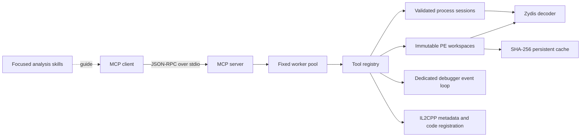

# ReverseMCP

[](https://github.com/Stingeer01/ReverseMCP)
[](https://en.cppreference.com/w/cpp/23)
[](https://modelcontextprotocol.io/)
[](https://github.com/Stingeer01/ReverseMCP/actions/workflows/ci.yml)
[](LICENSE)

ReverseMCP is a native C++23 Model Context Protocol server for reverse-engineering work on Windows. It gives an MCP client structured access to PE files, live process memory, x86/x64 disassembly, breakpoints, thread state, stack traces, and persistent analyst annotations.

The repository contains both parts of the system:

- a native execution layer with 44 bounded MCP tools;
- a knowledge layer with focused skills for native binaries, debuggers, protected code, managed runtimes, and popular game engines.

The executable and internal C++ namespace retain the name `reverseplugin` for compatibility. ReverseMCP is the project and distribution name.

## Why this exists

General-purpose shell tools force an agent to parse unstable text output and repeatedly reconstruct analysis state. ReverseMCP exposes addresses, instructions, operands, references, registers, memory regions, and debugger events as typed JSON. Static results are keyed by the binary SHA-256, so an unchanged file can reuse previous function discovery, xrefs, strings, CFGs, names, comments, and types.

ReverseMCP is intended for agent-driven investigations where a graphical disassembler is unavailable or unnecessary. It covers a substantial part of an IDA MCP workflow, but it does not claim feature parity with IDA Pro. Version 1.1 has no native decompiler, GUI database import, ELF/Mach-O loader, ARM decoder, or plugin bridge to an existing IDB.

## Capabilities

### Static PE analysis

- PE32 and PE32+ validation without executing the input file.
- Sections, imports, exports, ordinals, forwarded exports, image layout, and entry point.
- File-backed reads and Zydis disassembly by RVA or virtual address.
- Structured instructions: exact bytes, mnemonic, operands, categories, branch type, relative targets, and register access.
- Wildcard AOB scans over file-backed sections.
- ASCII and UTF-16LE string indexing.
- Direct call, jump, immediate, and RIP-relative data references.
- Function discovery from the entry point, exports, x64 unwind records, and recursively reached direct calls.
- Bounded control-flow graphs, typed edges, basic blocks, and call graph data.
- Persistent names, comments, and type declarations isolated by content hash.

### Runtime memory

- Process discovery and cached read-only process handles.
- Loaded module inventory with exact base addresses and image sizes.
- Virtual memory maps with normalized permissions.
- Validated reads that reject unreadable, guarded, or uncommitted pages.
- Writes restricted to already writable committed pages, with old-byte capture and optional read-back verification.
- Pointer-chain traversal with signed offsets and x86/x64 pointer widths.
- Chunked wildcard AOB scans with cross-chunk matching.
- Typed unknown-value snapshots with iterative changed, unchanged, increased, and decreased filters.
- Live structured disassembly in Intel or AT&T syntax.

### Native debugger

- Win32 attach and detach without terminating the target.
- Managed `INT3` software breakpoints with original-byte restoration and reinsertion.
- Per-thread DR0–DR3 execute, write, and read/write hardware breakpoints.
- Asynchronous debugger events; waiting never blocks the MCP input loop.
- Register contexts, thread enumeration, ownership-tracked suspend/resume, and single-step.
- DbgHelp stack walking with modules, symbols, displacements, instruction pointers, stack pointers, and frame pointers.

### Unity IL2CPP

- Compact `global-metadata.dat` v38/v39 parsing with strict section and record validation.
- Static x86-64 `GameAssembly.dll` code-registration discovery without loading or executing the game.
- Managed image, namespace, type, field, method, parameter, token, flag, and slot records.
- Method-token resolution through per-image code-generation modules to native RVA and preferred VA.
- Bounded filtered queries for interactive work and atomic JSONL export for complete dumps.
- In-process workspace reuse keyed by canonical paths, sizes, and modification times; SHA-256 identities are returned for both inputs.

### Knowledge skills

The native server performs deterministic work. Skills describe how an agent should combine those primitives and how to validate version-sensitive assumptions.

- `reverse-analysis` — router, evidence rules, and shared operating procedure.
- `native-binary-triage` — loader-first PE, ELF, and Mach-O triage and toolchain recognition.
- `decompiler-guided-analysis` — ABI, data-flow, types, vtables, and indirect calls.
- `runtime-debugging` — reproducible breakpoint-driven investigations.
- `protected-binary-analysis` — packers, anti-debugging, self-modification, control-flow flattening, and virtualized code.
- `unity-il2cpp-analysis` — Mono and IL2CPP metadata, registrations, objects, methods, and assets.
- `unreal-engine-analysis` — UObject reflection, names, object arrays, functions, Blueprints, PAK, and IoStore.
- `godot-engine-analysis` — ClassDB, Object/Variant, GDScript, GDExtension, resources, and PCK.
- `source-engine-analysis` — Source and Source 2 interfaces, entities, network metadata, schemas, BSP, and VPK.
- `managed-runtime-analysis` — CLI metadata, .NET and Mono JIT, ReadyToRun, trimming, single-file applications, and NativeAOT.

See [the knowledge-base design](docs/KNOWLEDGE_BASE.md) for the source and extension policy.

## Requirements

- Windows 10 or 11, x64 host.
- Visual Studio 2022 with the Desktop development with C++ workload.
- CMake 3.25 or newer.
- Python 3 for knowledge-skill validation.
- Git, required by CMake when fetching Zydis.

The first configure downloads pinned versions of Zydis 4.1.1 and JSON for Modern C++ 3.11.3. Later builds reuse CMake's dependency checkout.

## Build and test

From a Visual Studio developer shell or PowerShell with MSVC available:

```powershell
git clone https://github.com/Stingeer01/ReverseMCP.git
Set-Location ReverseMCP
./scripts/build.ps1
```

The server is written to:

```text
build/release/Release/reverseplugin-mcp.exe
```

Run the complete test suite independently with:

```powershell
ctest --preset release
```

The test preset covers MCP framing and schemas, PE parsing, cache round-trips, CFG recovery, memory access, Zydis decoding, stack walking, a real child-process debugger integration test, all ten skills, and the stress suite.

## Connect an MCP client

The repository is already a Codex plugin. Its `.mcp.json` starts the release executable through `${CURSOR_PLUGIN_ROOT}`. For another MCP client, use the equivalent absolute path:

```json
{
  "mcpServers": {
    "reverseplugin": {
      "type": "stdio",
      "command": "C:/absolute/path/to/ReverseMCP/build/release/Release/reverseplugin-mcp.exe",
      "args": [],
      "cwd": "C:/absolute/path/to/ReverseMCP"
    }
  }
}
```

Transport is newline-delimited JSON-RPC 2.0 over standard input and output. Diagnostics go to standard error so they cannot corrupt protocol frames. The server implements MCP initialization, ping, tool discovery, and tool calls. Tool work runs on a fixed worker pool rather than the input thread.

## Typical workflows

### Analyze a binary without running it

1. Call `open_binary` with the executable or DLL path.
2. Read sections, imports, and exports with `get_binary_index`.
3. Run `discover_binary_functions` and `find_binary_strings`.
4. Follow targets with `find_binary_xrefs` and `analyze_binary_function`.
5. Save conclusions through `set_binary_annotation`.
6. Call `close_binary` when the in-memory workspace is no longer needed.

All stable identities are RVAs. Virtual addresses are also returned for display. Addresses are serialized as hexadecimal strings to avoid JSON and model precision loss.

### Dump a Unity IL2CPP build

1. Call `open_il2cpp_workspace` with `global-metadata.dat` and the matching `GameAssembly.dll`.
2. Select an image, namespace, or type with `dump_il2cpp_types`.
3. Use each method's `native_rva` for static reads, xrefs, CFG recovery, and annotations in the ordinary PE workspace.
4. Use `export_il2cpp_jsonl` for a complete streaming dump that does not retain a second JSON tree in memory.
5. Call `close_il2cpp_workspace` when the metadata buffers are no longer needed.

Native addresses are reported only when the code-generation module contains a file-backed pointer. Runtime-initialized pointers remain `null`; the server does not invent an address.

### Inspect a running process

1. Narrow `list_processes` by executable name.
2. Call `attach_process`; this requests query and memory-read rights only.
3. Use `list_modules` and `query_memory_regions` to establish a valid range.
4. Read, scan, follow pointers, or disassemble within that range.
5. Call `detach_process` to release the cached handle.

`write_memory` is explicit and separate. It never changes page protection and can only write to committed pages that are already writable.

### Debug a process

1. Call `debug_attach` to create an independent debugger session.
2. Set a software or hardware breakpoint.
3. Use `wait_debug_event` until the target pauses.
4. Inspect registers, threads, the stack trace, and nearby instructions.
5. Call `continue_debug_event` or `single_step`.
6. Always finish with `debug_detach`.

Read-only `session_id` values and debugger `debug_session_id` values have different lifecycles. They cannot be used interchangeably.

## Tool reference

ReverseMCP exposes 44 tools. [TOOLS.md](docs/TOOLS.md) groups them by lifecycle and documents their limits, mutability, and expected use. Every tool also publishes its exact input and output JSON Schemas through MCP `tools/list`; those runtime schemas are the canonical machine-readable contract.

## Architecture



The boundaries are deliberate:

- `src/mcp` owns framing, JSON-RPC dispatch, schema discovery, and result envelopes.
- `src/tools` translates MCP requests into typed domain operations.
- `src/analysis` owns immutable images, discovery, CFG recovery, annotations, and persistent cache records.
- `src/process` and `src/memory` own Win32 handles, page validation, scans, and snapshots.
- `src/debug` owns the debugger thread, breakpoints, register state, and stack walking.
- `src/disasm` is the Zydis adapter.
- `src/il2cpp` owns compact metadata parsing, PE registration discovery, module tables, and token-to-RVA mapping.
- `skills` contains no native execution code.

Read [ARCHITECTURE.md](docs/ARCHITECTURE.md) for ownership, concurrency, caching, and failure semantics.

## Caching and local data

An open image is reused in memory when its canonical path, size, and modification time have not changed. Deterministic results are stored under:

```text
%LOCALAPPDATA%/ReversePlugin/analysis-cache-v1/<binary-sha256>/
```

The cache contains derived analysis and user annotations, not a copy of the input binary. Records are replaced atomically. A different binary hash receives a separate directory, even when the filename is the same. Delete `analysis-cache-v1` while the server is stopped to clear all persistent analysis.

## Resource and safety boundaries

- Input files are opened read-only and capped at 2 GiB.
- Expensive scans, result counts, CFGs, snapshots, and individual memory operations have explicit limits.
- Runtime reads validate every covered memory region.
- Runtime writes require existing write permission and support verification.
- Debug detach restores managed software breakpoints and suspensions owned by the session.
- Unknown exceptions can be passed back to the target instead of being swallowed.
- Tool failures return structured MCP errors; invalid JSON, addresses, session identifiers, or ranges do not terminate the server.

Use ReverseMCP only on software and systems you own or are authorized to inspect. The project does not include workflows for bypassing licensing, anti-cheat systems, access controls, or third-party security enforcement. Vulnerability reports belong in the private process described in [SECURITY.md](SECURITY.md).

## Performance tests

`reverseplugin-stress-tests` exercises work volume rather than publishing a hardware-independent score:

- 1 GiB of wildcard AOB scanning;
- 512 MiB of typed snapshot comparisons;
- 200,000 concurrent `ReadProcessMemory` operations;
- 1.2 million decoded instructions across eight threads;
- concurrent static-image cache reuse;
- 20,000 MCP requests across eight workers.

The test prints local throughput and fails on lost results or invalid state. Numbers depend on CPU, memory, target layout, compiler, and security software; the project does not use a single developer machine as a performance claim.

## Releases

```powershell
./scripts/release.ps1
```

The release script performs a clean Release build, runs every CTest target, stages the executable, manifest, skills, documentation, and licenses, then writes a ZIP and SHA-256 checksum under `dist/`. Pushing a `v*` tag runs the same path in GitHub Actions and attaches both files to a GitHub release.

See [RELEASE.md](docs/RELEASE.md) for the version 1.1 compatibility contract.

## Contributing

Bug reports, focused tools, additional loaders, architecture backends, cache migrations, and well-sourced engine knowledge are welcome. Changes to runtime code need tests; changes to skills need authoritative references and must pass the knowledge validator. Start with [CONTRIBUTING.md](CONTRIBUTING.md).

## License

ReverseMCP is available under the [MIT License](LICENSE). Zydis, Zycore, and JSON for Modern C++ retain their own MIT copyright notices in [THIRD_PARTY_NOTICES.md](THIRD_PARTY_NOTICES.md).
